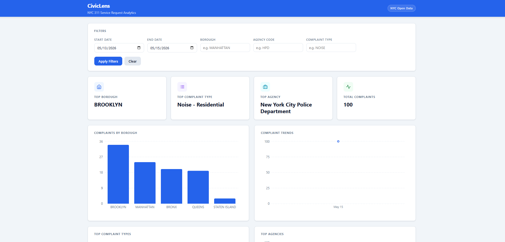
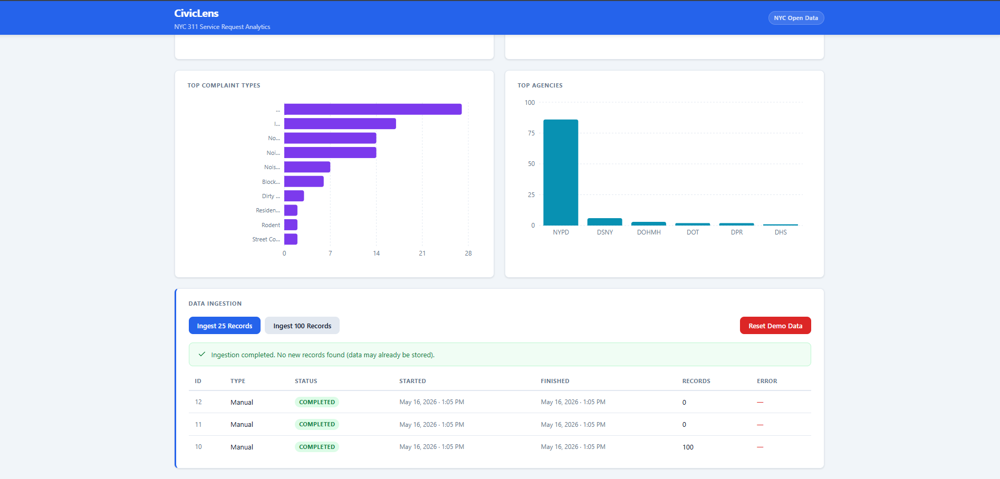

# CivicLens

A full-stack civic analytics platform that ingests live NYC 311 service request data, normalizes it into a relational PostgreSQL schema, and surfaces interactive analytics through a Spring Boot backend and React dashboard.

Built as a portfolio-quality engineering application emphasizing backend architecture, data ingestion pipelines, analytics APIs, full-stack integration, and real-world debugging.

## Screenshots

### Dashboard Overview

Interactive analytics dashboard showing complaint summaries, borough breakdowns, trend analysis, complaint category distribution, agency reporting patterns, and ingestion controls.



---

### Data Ingestion Administration

Administrative demo tooling for controlled ingestion, ingestion job history, and dashboard reset functionality.




---

## Table of Contents

- [Overview](#overview)
- [Features](#features)
- [Architecture](#architecture)
- [Tech Stack](#tech-stack)
- [Data Model](#data-model)
- [API Endpoints](#api-endpoints)
- [Local Setup](#local-setup)
- [Screenshots](#screenshots)
- [Engineering Challenges](#engineering-challenges)
- [Future Enhancements](#future-enhancements)
- [License](#license)

---

## Overview

New York City publishes large volumes of public 311 complaint data through its Open Data platform. CivicLens transforms that raw feed into a structured analytics experience: live ingestion, a normalized relational schema, REST analytics APIs, and an interactive dashboard.

The goal was to build something closer to a production-style internal analytics platform than a typical CRUD tutorial project.

**Core capabilities:**

- Live NYC 311 data ingestion
- Normalized relational data storage
- Analytics aggregation APIs
- Interactive dashboard filtering
- Ingestion job tracking
- Demo environment reset tooling
- Production-style frontend/backend integration

---

## Features

### Live Data Ingestion

CivicLens connects directly to the NYC Open Data 311 API and ingests live complaint records into PostgreSQL.

- Configurable ingestion batch sizes
- Deduplication using source identifiers
- Ingestion job tracking and failure logging
- Dashboard-triggered ingestion controls
- Repeatable demo workflows

### Analytics API

Backend endpoints support optional filtering by date range, borough, agency, and complaint type. Available analytics:

- Complaint counts by borough
- Top complaint categories
- Top reporting agencies
- Complaint volume trends over time

### Interactive Frontend Dashboard

A React dashboard providing:

- Interactive filtering controls
- Responsive charts
- Loading skeletons and clean empty states
- User-friendly error handling
- Dashboard ingestion controls
- Administrative demo reset capability

### Demo Administration

Repeatable demo workflows are first-class. Administrative controls allow you to:

- Ingest fresh sample data
- Reset all demo data
- Clear ingestion history
- Rebuild analytics from scratch

---

## Architecture

CivicLens follows a backend-first layered architecture.

```text
┌────────────────────────────────────────┐
│   React + TypeScript + Vite Frontend   │
└──────────────────┬─────────────────────┘
                   │
                   ▼
┌────────────────────────────────────────┐
│       REST API (Spring Boot)           │
└──────────────────┬─────────────────────┘
                   │
                   ▼
┌────────────────────────────────────────┐
│            Service Layer               │
└──────────────────┬─────────────────────┘
                   │
                   ▼
┌────────────────────────────────────────┐
│           Spring Data JPA              │
└──────────────────┬─────────────────────┘
                   │
                   ▼
┌────────────────────────────────────────┐
│         PostgreSQL Database            │
└──────────────────┬─────────────────────┘
                   │
                   ▼
┌────────────────────────────────────────┐
│      NYC Open Data 311 API             │
└────────────────────────────────────────┘
```

**Design goals:**

- Clean separation of concerns
- Production-style service layering
- Backend-owned business logic
- Normalized relational schema
- Frontend consuming real APIs only
- Simple, maintainable architecture

---

## Tech Stack

**Backend**
- Java 21
- Spring Boot 3 (Web, Data JPA, Actuator)
- PostgreSQL
- Flyway
- Maven
- Springdoc OpenAPI / Swagger

**Frontend**
- React
- TypeScript
- Vite
- Recharts
- CSS

**External Data Source**
- NYC Open Data 311 Service Requests API

---

## Data Model

CivicLens uses a normalized relational design.

### Borough

Reference entity representing NYC boroughs (Brooklyn, Manhattan, Queens, Bronx, Staten Island).

### Agency

Normalized city agency records (NYPD, DOT, DSNY, DOHMH, etc.).

### ComplaintType

Normalized complaint categories (Noise - Residential, Illegal Parking, Street Condition, Rodent, etc.).

### Complaint

Primary fact table:

- NYC source identifier
- Created timestamp
- Closed timestamp
- Status
- Latitude / longitude
- Borough reference
- Agency reference
- Complaint type reference
- Ingestion timestamp

### IngestionJob

Tracks ingestion activity:

- Job type
- Status
- Started / finished timestamps
- Records processed
- Error details

---

## API Endpoints

### Health

```http
GET /api/health
```

### Ingestion

```http
POST   /api/admin/ingest/311?limit=25     # Trigger ingestion
GET    /api/admin/ingest/jobs             # Ingestion job history
DELETE /api/admin/ingest/demo-data        # Reset demo environment
```

### Analytics

```http
GET /api/analytics/complaints/by-borough
GET /api/analytics/complaints/top-types
GET /api/analytics/agencies/top
GET /api/analytics/complaints/trends
```

**Example filtered request:**

```http
GET /api/analytics/complaints/by-borough?startDate=2026-05-14&endDate=2026-05-14&borough=Brooklyn
```

Full interactive documentation is available via Swagger UI once the backend is running (see [Local Setup](#local-setup)).

---

## Local Setup

### Prerequisites

- Java 21
- PostgreSQL 16+
- Node.js 20+ and npm

The Maven wrapper (`./mvnw`) is included — no separate Maven install needed.

### Database Setup

Create the local database:

```sql
CREATE DATABASE civiclens;
```

Configure datasource values (environment variables or `application.properties`):

```text
SPRING_DATASOURCE_URL=jdbc:postgresql://localhost:5432/civiclens
SPRING_DATASOURCE_USERNAME=civiclens
SPRING_DATASOURCE_PASSWORD=your_password
```

Flyway migrations run automatically at startup.

### Run Backend

From the project root:

```bash
./mvnw spring-boot:run
```

| Service      | URL                                       |
|--------------|-------------------------------------------|
| Backend API  | `http://localhost:8080`                   |
| Swagger UI   | `http://localhost:8080/swagger-ui.html`   |

### Run Frontend

```bash
cd frontend
npm install
npm run dev
```

Frontend: `http://localhost:5173`

---

## Screenshots

Screenshots will be added once deployed.

```markdown


```

---

## Engineering Challenges

Three real debugging stories from building this project.

### PostgreSQL Native Query Parameter Typing

Analytics endpoints support optional filtering, which initially produced PostgreSQL errors like:

```text
could not determine data type of parameter
```

The root cause was PostgreSQL native query behavior with nullable optional parameters. Resolution involved:

- Explicit SQL parameter casting
- Refactoring nullable filter conditions
- Timestamp boundary corrections for date filtering

This was a genuine backend debugging problem rooted in PostgreSQL semantics — not a business logic defect.

### CORS Preflight Debugging

The dashboard demo reset feature initially failed when triggered from the frontend.

**Root cause:** Browser DELETE requests triggered a CORS preflight `OPTIONS` request, but backend CORS configuration allowed only `GET` and `POST`.

**Resolution:** Added `DELETE` and `OPTIONS` support to the CORS configuration and restarted the backend.

A practical, instructive frontend/backend integration issue.

### External API Reliability

NYC Open Data occasionally returns transient failures during ingestion. CivicLens handles this by:

- Recording failed ingestion jobs
- Preserving failure history
- Allowing immediate retry from the dashboard

This reflects realistic external dependency behavior rather than assuming a perfect upstream.

---

## Future Enhancements

- Cloud deployment
- Authentication and role-based admin access
- Scheduled ingestion jobs with retry policies
- Analytics query caching
- CSV export
- Interactive maps
- Complaint detail drill-down
- Docker containerization
- CI/CD pipeline
- Monitoring and observability

---

## Why This Project

CivicLens demonstrates practical engineering skills across:

- Backend API development
- Relational data modeling
- Public API integration
- Data ingestion pipelines
- Analytics query design
- Frontend API integration
- Production-style debugging
- Full-stack application delivery

The emphasis is on engineering decisions and implementation realism rather than tutorial-style feature breadth.

---

## Author

**Gregory V. Luna**
[LinkedIn](https://linkedin.com/in/gregvluna) · [GitHub](https://github.com/gregluna4809)

---

## License

Portfolio / educational use.
